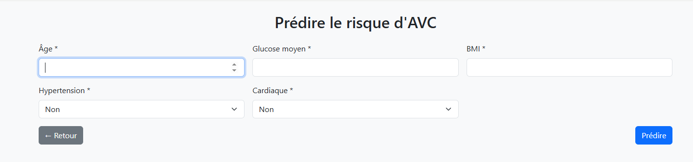

# 1. Application d'analyse et prédiction du risque d'AVC chez différentes catégories de patients

Ce projet est une application web complète développée en Python (Flask), permettant de :

- Gérer une base de données de patients ayant eu un AVC (Accident Vasculaire Cérébral)
- Analyser et nettoyer un dataset public (données santé AVC) téléchargé depuis la plateforme Kaggle
- Visualiser les informations concernant les patients sous forme de tableau interactif
- Explorer les données grâce à des graphiques interactifs (âge, genre, glucose, IMC, etc.)
- Filtrer les patients selon plusieurs critères (genre, âge, type de travail, résidence)
- Exporter les résultats filtrés en CSV et PDF
- Ajouter, modifier ou supprimer des patients
- Connecter et insérer les données dans une base PostgreSQL (gestion via pgAdmin)
- Introduire une modélisation prédictive (Machine Learning) pour estimer le risque d’AVC
- Prédire le risque d'AVC à l’aide d’un formulaire dynamique, dont les champs sont validés côté client (HTML) et côté serveur (Flask)

L'application web est développée avec **Flask** et connectée à **PostgreSQL**.  
L'analyse exploratoire et les visualisations sont réalisées dans un **notebook Jupyter**.  
Le design est modernisé avec **Bootstrap** pour une interface claire, responsive et conviviale.

> Le modèle utilisé pour la prédiction est un **Random Forest Classifier**, entraîné sur les variables cliniques et démographiques du patient à partir des données nettoyées.

# 2. Objectif

L'objectif principal de ce projet est de concevoir une **application web interactive** qui permet d'exploiter un dataset médical réel sur les **Accidents Vasculaires Cérébraux (AVC)**, afin de :

- Analyser les données du dataset **healthcare-dataset-stroke-data.csv** (provenant de Kaggle) via un **notebook Jupyter** (nettoyage, traitement, visualisation)
- Stocker les données nettoyées dans une **base PostgreSQL**
- Interagir avec les données via une interface web développée avec **Flask** (ajout, modification, suppression, filtrage, export PDF/CSV)
- Visualiser les relations entre différentes variables médicales et sociodémographiques grâce à **Seaborn** et **Matplotlib**
- Prédire le risque d’AVC pour un patient donné à l’aide d’un **modèle de Machine Learning** intégré à l’application

> Ce projet combine **analyse de données**, **développement web**, **base de données** et **intelligence artificielle** dans une application unifiée.

# 3. Structure du projet

stroke-project/
│
├── app_flask/ # Application Flask (fichiers Python et templates HTML)
│ ├── projet.py # Fichier principal Flask (routes, logique web)
│ ├── templates/ # Fichiers HTML (index, ajout, modification, prédiction)
│ │ ├── index.html
│ │ ├── add_patient.html
│ │ ├── edit_patient.html
│ │ └── predict.html          
│
├── Data/ # Données sources (healthcare-dataset-stroke-data.csv)
│
├── notebooks/ # Notebook Jupyter (nettoyage, visualisation, ML)
│ └── Untitled7.ipynb
│
├── screenshoots/ # Captures d'écran pour illustrer l'application et les visualisations
│ ├── index.png
│ ├── Ajout_patient.png
│ ├── Edit.png
│ ├── AVC-genre-age.PNG
│ ├── Tabagisme.png
│ ├── type-de-travail.png
│ ├── relationGlucoseIMCAVG.PNG
│ ├── MatriceDeConfusion.png
│ └── prediction.png          
│
├── requirements.txt # Liste des dépendances Python
└── README.md # Documentation du projet (ce fichier)

# 4. Technologies utilisées

- **Python** 
- **Flask** — Framework web léger pour le backend
- **PostgreSQL** — Base de données relationnelle
- **pgAdmin** — Interface graphique pour gérer PostgreSQL
- **Pandas** — Nettoyage et manipulation des données
- **Seaborn & Matplotlib** — Visualisations statistiques et exploratoires
- **Scikit-learn** — Modélisation prédictive (classification du risque d'AVC)
- **FPDF** — Génération de rapports PDF
- **Jupyter Notebook** — Analyse exploratoire et prototypage
- **HTML & Jinja2** — Templates dynamiques pour l'interface web
- **Bootstrap** — Stylisation et design responsive
- **Kaggle** — Source du dataset utilisé

# 5. Installation et exécution

## Prérequis

- Python 3.13.2
- PostgreSQL installé et configuré (via pgAdmin)
- Dataset téléchargé depuis Kaggle (healthcare-dataset-stroke-data.csv)

## Installation effectuées

# Cloner le dépôt
git clone https://github.com/Massilia/ton-depot.git
cd stroke-project

# Installer les dépendances
pip install -r requirements.txt

# Configuration de la base PostgreSQL
    
    Lancer pgAdmin 
    Créer une base stroke_db via pgAdmin
    Créer la table patients avec la structure définie dans le notebook (Untitled7.ipynb) ou dans le code Flask (projet.py)
    Vérifier que la connexion PostgreSQL dans projet.py correspond à vos identifiants et port (host, user, password, dbname, etc.)

# Lancer l'application Flask
python app_flask/projet.py
L'application sera accessible localement à l’adresse :
 http://127.0.0.1:5000

# Notebook

Pour explorer les visualisations et effectuer l'analyse exploratoire :

    Ouvrir le fichier notebooks/Untitled7.ipynb

    Exécuter toutes les cellules dans Jupyter
# 6. Aperçu et captures d'écran

Voici quelques captures d'écran de l'application pour illustrer son interface et ses fonctionnalités :

## Interface principale (tableau des patients)

## Formulaire d'ajout d'un patient

## Formulaire de modification d'un patient

## Formulaire de prédiction 

##  Notebook (Les visualisations)

Voici quelques exemples de visualisations générées dans le notebook :

### Distribution des AVC par genre et Boxplot de l'âge selon AVC

### Statut tabagique et AVC

### Type de travail et AVC

### Relation glucose/IMC/AVC

### Matrice de confusion

 **D'autres visualisations et analyses détaillées sont disponibles dans le notebook complet (notebooks/Untitled7.ipynb).**

 # 7. Auteur & Contexte

Ce projet a été réalisé dans le cadre du module **"Outils libres pour le développement logiciel"**, Master 1 Informatique.

-  **Auteur** : Massilia Oumaza
-  **Formation** : Master 1 Informatique parcours Big Data et fouille de données
-  **Université** :  IED Université Paris 8
-  **Date** : 01 juillet 2025

